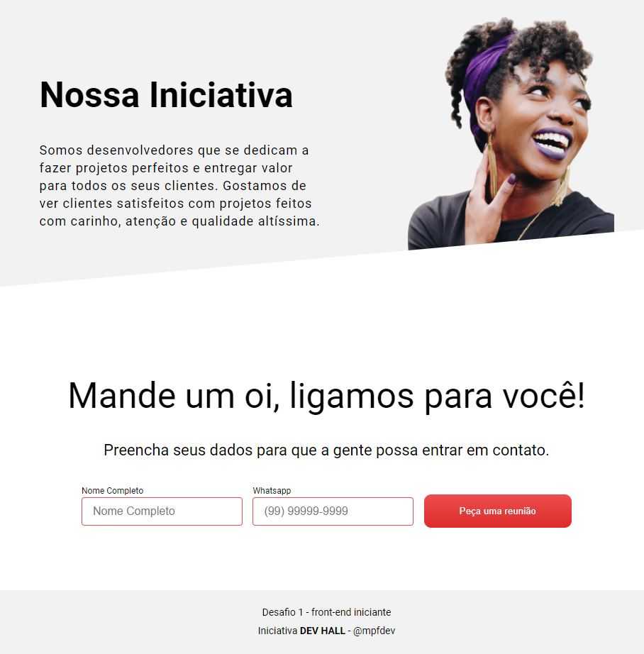
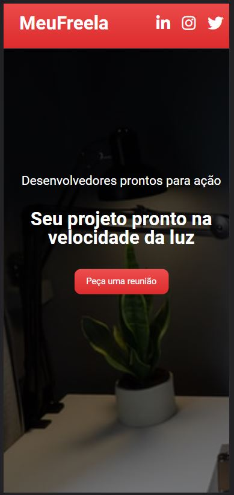

# Dev Hall Challenge Front end - desafio 1

Essa é a minha solução para o desafio de iniciante do Dev Hall. Abrangendo HTML, CSS e JavaScript. Esse foi um desafio, onde o design desenvolvido no figma foi entregue com a visão para desktop-first, sem planos para telas menores. Apesar disso, o projeto a ser entregue está responsivo para tamanhos de tela como o iPad e o iPhoneX.

## Conteúdo

- [Overview](#overview)
  - [O Desafio](#the-challenge)
  - [Screenshot](#screenshot)
  - [Links](#links)
- [My process](#my-process)
  - [Built with](#built-with)
  - [What I learned](#what-i-learned)
  - [Continued development](#continued-development)
  - [Useful resources](#useful-resources)
- [Author](#author)
- [Acknowledgments](#acknowledgments)

## Overview

### O Desafio

O cliente, **que é um tremendo mão de vaca**, solicitou um website simples que mostra que você sabe fazer um site. Para tanto, pediu para ter algumas questões importantes:

- A foto de fundo precisa ocupar toda a dobra da página
- O formulário precisa ter estes dois campos, de nome e whatsapp
- O cliente exigiu que o site fosse responsivo, mas não pagou o designer para fazer as telas responsivas. E teu chefe tá pedindo pra tu se virar.
- Não definiu nenhum hover, e nenhuma animação. Mas é o site que tu precisa fazer para ganhar aquele bônus no final do ano.

O cliente vai pagar algum desenvolvedor back end para fazer o formulário final, mas vai que você se empolga e entrega isto para o teu cliente. **#vemBonus!**

### Screenshot

Aqui estão algumas screenshots do resultado final.

##### Desktop - view




##### Tablet - view


##### Mobile - view



### Links

- Live Site URL: [Space Dev Challenge](https://spacedevchallenge.netlify.app/index.html)

## Meu processo

### Construido utilizando os seguintes principios

- Semantic HTML5 markup
- CSS custom properties
- Flexbox
- Desktop-first workflow
- Node.js & Express
- Express-Validator
- BodyParser

### O que eu aprendi

Este desafio em específico teve a parte em fazer as telas responsáveis sem ter nenhum design como referência, além de fazer parte da validação do servidor para o formulário visto as lógicas requisitadas.

Estou na fase do aprendizado onde estou começando a estudar Node.js/Express, então o desafio veio na hora certa, pois pude manter em conjunto o que já vinha estudando com HTML, CSS e JS, e poder pensar também no servidor.

### Para o futuro

- Certamente trabalhar a questão do backend de forma mais cuidadosa, e melhor tratada.
- Passar a trabalhar com medidas em rem, e não mais usar px, a fim de deixar a responsividade mais fluída.
- Refazer utilizando alguma framework no frontend.

## Autor

- Twitter - [@mpfdev](https://www.twitter.com/mpfdev)

## Como instalar

### Pré-requisitos

É necessário ter o Node.js instalado.

### Instalação

1. Clone o repositório
   ```sh
   git clone https://github.com/mpfdev/desafio-frontend.git
   ```
2. Instale os pacotes via NPM
   ```sh
   npm install
   ```
3. Comece o servidor
   ```sh
   node server.js
   ```
